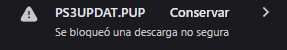

# 🎮 Tekken 5 DR en RPCS3 (Online) — Tekken Warriors PY

Guía completa para instalar **Tekken 5 Dark Resurrection** en RPCS3 y jugar online mediante **RPCN**.

> ⚠️ Esta guía está pensada para mantener una estructura ordenada. Se recomienda seguirla exactamente.

---

## 📑 Índice

- [1. Requisitos](#1-requisitos)
- [2. Estructura de carpetas](#2-estructura-de-carpetas)
- [3. Instalación de RPCS3](#3-instalación-de-rpcs3)
- [4. Instalación del Firmware](#4-instalación-del-firmware)
- [5. Instalación del juego](#5-instalación-del-juego)
- [6. Configuración Online (RPCN)](#6-configuración-online-rpcn)
- [7. Primer inicio](#7-primer-inicio)
- [8. Recomendaciones](#8-recomendaciones)

---

## 1. Requisitos

Descargar los siguientes archivos:

- RPCS3 → **https://rpcs3.net/** 

Seleccionen "Download" en la pantalla principal y luego en la sección "Windows" seleccionen "Download for x64"

- Firmware de PS3 `PS3UPDAT.PUP` → **https://www.playstation.com/en-us/support/hardware/ps3/system-software/** 

De aqui seleccionen "Update using a computer" y denle click derecho a "Download PS3 Update" y seleccionen "Guardar vínculo como", su navegador acusará de ser un archivo malicioso pero deben aceptar la descarga en el gestor de descargas de su navegador 



- Tekken 5 DR → **https://romspure.cc/download/tekken-5-dark-resurrection-online-110121/5** 

Deben esperar unos segundos antes que se les aparezca el botón amarillo "Download (590.92 M)" y descargar.

---

## 2. Estructura de carpetas

Crear una carpeta llamada `PS3` en la ubicación que prefieras y copia las descargas del paso anterior adentro de la misma.

La estructura final al descargar los archivos debe verse así:

```
PS3/
├── RPCS3/
├── PS3UPDAT.PUP
└── Tekken 5/
```

---

## 3. Instalación de RPCS3

1. Descargar RPCS3

2. Copiar la descarga a la carpeta PS3 creada anteriormente

2. Click derecho sobre el archivo descargado

3. Seleccionar **"Extraer todo"** (Windows 10 / 11)

   

4. Eliminar el archivo comprimido

5. Renombrar la carpeta a:

```
RPCS3
```

6. Entrar en la carpeta y ejecutar:

```
rpcs3.exe
```

7. En la primera pantalla:

   * Desmarcar **"Show at startup"** (opcional)
   * Marcar **"I have read the Quickstart guide"** (requerido)
   * Click en **Continue**

   

---

## 4. Instalación del Firmware

1. En el menú superior:

   ```
   File > Install Firmware
   ```

2. Seleccionar el archivo:

   ```
   PS3UPDAT.PUP
   ```

3. Esperar a que finalice la instalación

✅ RPCS3 queda listo para usar.

---

## 5. Instalación del juego

1. En RPCS3, En el borde superior del emulador ir a:

   ```
   File > Install Packages
   ```

2. Abrir la carpeta Descomprimir el juego:

   * Click derecho en el archivo del juego → **"Extraer todo"**

3. Abrir la carpeta `PS3` y luego dentro de la carpeta deben existir **2 archivos**:

   * Archivo del juego
   * Archivo de licencia

4. Seleccionar ambos archivos y hacer click en **Abrir**

5. Dejamos todos los ajustes en predeterminado, Click en:

   ```
   Install
   ```

6. Esperar a que termine la instalación

   

✅ Ya puedes jugar **offline**.

---

## 6. Configuración Online (RPCN)

### Crear cuenta RPCN

1. En el borde superior del emulador ir a:

   ```
   Manage > Network Services > RPCN
   ```

2. En **Account**:

   * Click en **Create Account**
   * Completar en cada formulario:

     * Usuario
     * Contraseña
     * Email válido

3. Confirmar con **Yes**

4. Ingresar el **Token** recibido por email

5. Click en **OK**

6. Verificar con el botón:

   ```
   Test Account
   ```
   

---

### Configurar red

En el borde superior del emulador ir a:

```
Configuration > Network
```

Configurar de la siguiente manera:

| Opción         | Valor     |
| -------------- | --------- |
| Network Status | Connected |
| Enable UPNP    | Enabled   |
| PSN Status     | RPCN      |
| Country        | Paraguay  |


Guardar cambios con:

```
"Apply" y luego "Save"
```

---

## 7. Primer inicio

1. Abrir el juego

2. Aceptar descarga de datos adicionales (**Yes**)

   

3. Reiniciar el emulador cuando termine la descarga:

   * `Alt + F4` o cerrar ventana

4. Volver a abrir el juego

---

## 8. Recomendaciones

### ⚠️ Importante

* En el primer acceso a **Online Battle**:

  * Aceptar términos y condiciones

### 🎯 Para evitar errores/crasheos

En Online Battle usar únicamente:

* Create Room
* Custom Battle (Para buscar las salas)
* Profile

---

## 🎮 Listo

Ahora puedes jugar Tekken 5 DR online con la comunidad.

**Get ready for the next battle!**